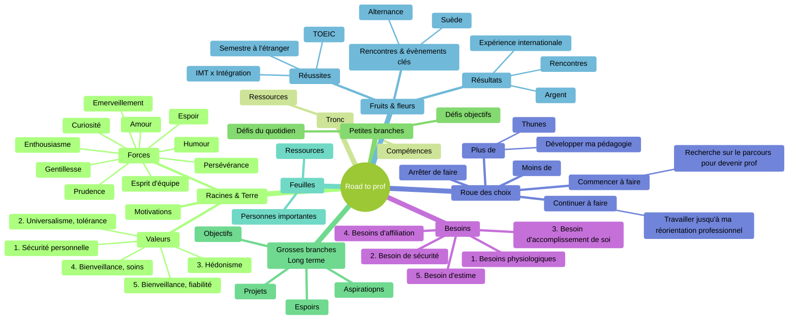

```mermaid
%%{init: {'theme':'forest'}}%%
mindmap
  root((Road to prof))
    Racines & Terre
        Forces
            Curiosité
            Emerveillement
            Espoir
            Humour
            Esprit d'équipe
            Prudence
            Enthousiasme
            Persévérance
            Gentillesse
            Amour
        Motivations
        Valeurs
            1. Sécurité personnelle
            2. Universalisme, tolérance
            3. Hédonisme
            4. Bienveillance, soins
            5. Bienveillance, fiabilité
    Tronc
        Compétences
        Ressources
    Petites branches
        Défis objectifs
        Défis du quotidien
    Grosses branches<br/>Long terme
        Objectifs
        Aspiratiopns
        Espoirs
        Projets
    Feuilles
        Personnes importantes
        Ressources
    Fruits & fleurs
        Réussites
            IMT x Intégration
            Semestre à l'étranger
            TOEIC
        Résultats
            Expérience internationale
            Rencontres
            Argent
        Rencontres & évènements clés
            Suède
            Alternance
    Roue des choix
        Commencer à faire
            Recherche sur le parcours pour devenir prof
        Continuer à faire
            Travailler jusqu'à ma réorientation professionnel
        Arrêter de faire
        Plus de
            Développer ma pédagogie
            Thunes
        Moins de
    Besoins
        1. Besoins physiologiques
        2. Besoin de sécurité
        3. Besoin d'accomplissement de soi
        4. Besoins d'affiliation
        5. Besoin d'estime
```
