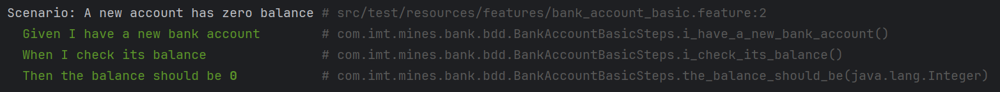

# Exercice 11



## Cucumber test

```java
public class BankAccountBasicSteps {

    private BankAccount account;
    private int observedBalance;

    @Given("I have a new bank account")
    public void i_have_a_new_bank_account() {
        account = new BankAccount();
    }

    @When("I check its balance")
    public void i_check_its_balance() {
        double balance = account.getBalance();
        observedBalance = (int) balance;
    }

    @Then("the balance should be {int}")
    public void the_balance_should_be(Integer expected) {
        assertEquals(expected.intValue(), observedBalance);
    }
}
```
