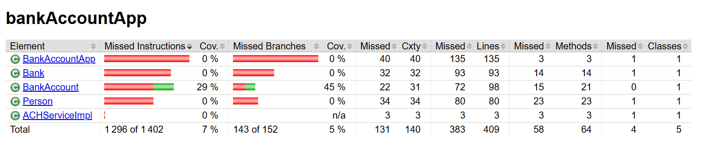
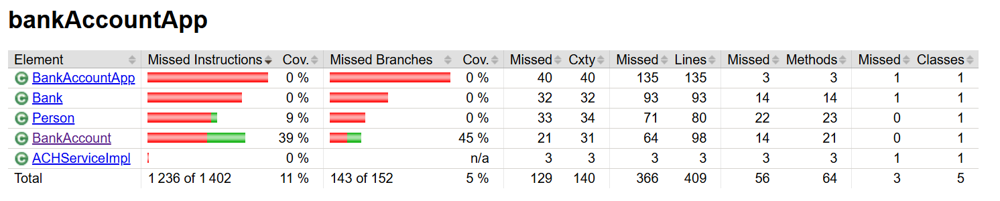

# Exercice 9

## Before



## After



## Added test

```java
@Test
void shouldInitBankAccountWithBalance() {
    Person person = new Person();
    BankAccount bankAccount = new BankAccount(100, 1000, "date", person);

    assertEquals(100, bankAccount.getBalance());
}
```
